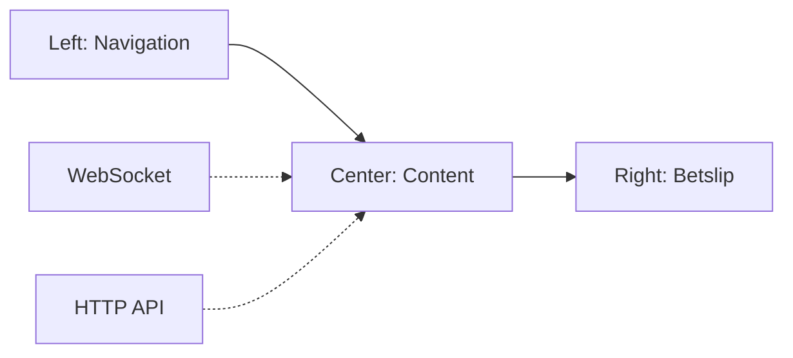

## What is fe-desktop?

fe-desktop is a modern web application for sports betting built with React/Preact. It provides a comprehensive betting interface with real-time updates, live events, and a rich user experience.

## Who is this for?

This project is designed for:

- **Frontend developers** working on the sports betting platform
- **Integration partners** embedding the betting interface via iFrame
- **QA engineers** testing betting functionality
- **DevOps engineers** deploying and maintaining the application

## Key features

<CardGroup cols={2}>
  <Card title="Real-time updates" icon="bolt">
    WebSocket-based live updates for odds, scores, and events
  </Card>
  <Card title="Multi-language support" icon="globe">
    i18next integration with 20+ languages
  </Card>
  <Card title="Responsive design" icon="mobile">
    Optimized for desktop, tablet, and mobile devices
  </Card>
  <Card title="Theme customization" icon="palette">
    Multiple themes with custom styling support
  </Card>
  <Card title="iFrame integration" icon="window">
    Embeddable widget for partner websites
  </Card>
  <Card title="State management" icon="database">
    MobX-powered reactive state management
  </Card>
</CardGroup>

## Technology stack

The application is built with modern web technologies:

- **Language**: TypeScript and JavaScript
- **Renderer**: Preact (React-compatible)
- **Routing**: React Router v7
- **Bundler**: Webpack 5
- **Transpiler**: SWC
- **Styling**: Sass + Tailwind CSS
- **State**: MobX
- **Networking**: WebSocket (Socket.io) + Axios
- **i18n**: i18next
- **Animations**: Motion

## Architecture overview

The application follows a three-column layout structure:



### Core components

- **RootStore**: Central MobX state management
- **SocketService**: Real-time WebSocket connection
- **HttpClient**: REST API communication
- **AuthResolver**: Authentication and authorization
- **LayoutGames**: Main application layout

## Project structure

```
fe-desktop/
├── src/
│   ├── app/           # Core application logic
│   ├── components/    # Reusable UI components
│   ├── modules/       # Feature modules (Betslip, Layout, etc.)
│   ├── pages/         # Route pages
│   ├── lib/           # Libraries (MobX stores, API clients)
│   ├── widgets/       # Standalone widgets
│   ├── theme/         # Styling and themes
│   └── translates/    # i18n translations
├── public/            # Static assets
├── packages/          # Widget packages
└── docs/              # Documentation
```

## Next steps

<CardGroup cols={2}>
  <Card title="Installation" icon="download" href="/fe-desktop/installation">
    Set up your development environment
  </Card>
  <Card title="Quickstart" icon="rocket" href="/fe-desktop/quickstart">
    Get started with a basic example
  </Card>
  <Card title="Configuration" icon="gear" href="/fe-desktop/configuration">
    Configure the application
  </Card>
  <Card title="Contributing" icon="code" href="/fe-desktop/contributing">
    Learn how to contribute
  </Card>
</CardGroup>
