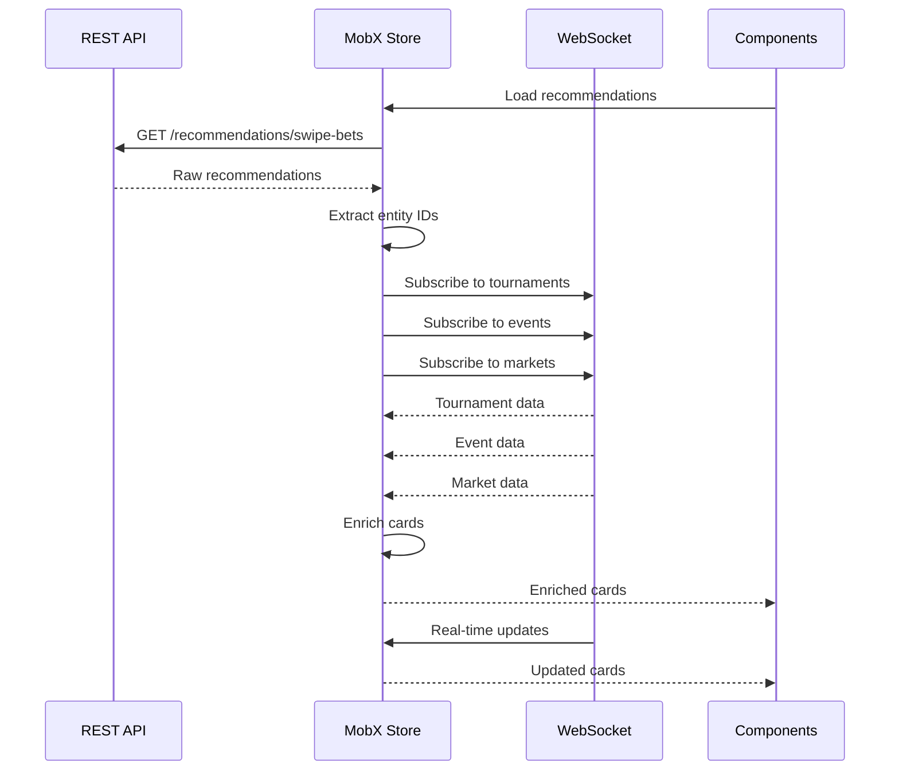

# API integration

This document covers all API interactions for the Swipe Bets feature, including REST endpoints, WebSocket subscriptions, and data structures.

## REST API endpoints

### Get Swipe Bets recommendations

Fetches personalized betting recommendations for the swipe interface.

**Endpoint**: `GET /recommendations/swipe-bets`

**Parameters**:

| Parameter | Type | Required | Description |
|-----------|------|----------|-------------|
| `disciplinesIds` | string[] | No | Array of discipline IDs to filter recommendations |
| `excludeIds` | string[] | No | Array of recommendation IDs to exclude |
| `pageNumber` | number | No | Page number for pagination (default: 1) |
| `pageSize` | number | No | Number of items per page (default: 100) |

**Request example**:
```javascript
import { getSwipeBets } from '@/lib/api/recommendations';

const response = await getSwipeBets({
  disciplinesIds: ['1', '2', '12'], // Football, Basketball, Tennis
  excludeIds: ['rec_123', 'rec_456'],
  pageNumber: 1,
  pageSize: 100
});
```

**Response structure**:
```typescript
interface ISwipeBetsResponse {
  data: ISwipeBetItem[];
  meta: {
    pageNumber: number;
    pageSize: number;
    totalRows: number;
  };
}

interface ISwipeBetItem {
  _id: string;                    // Unique recommendation ID
  disciplineId: string;           // Sport discipline ID
  eventDate: string;              // ISO date string
  eventId: string;                // Event ID
  eventMarketId: string;          // Market ID within event
  eventMarketName: string;        // Market display name
  eventName: string;              // Event display name
  eventSlug: string;              // URL-friendly event slug
  eventTopIndex: number;          // Event popularity ranking
  outcomeId: string;              // Outcome ID
  outcomeName: string;            // Outcome display name
  price: number;                  // Current odds
  sortIndex: number;              // Recommendation sort order
  tier: number;                   // Recommendation tier (1-3)
  tournamentId: string;           // Tournament ID
}
```

**Response example**:
```json
{
  "data": [
    {
      "_id": "rec_abc123",
      "disciplineId": "1",
      "eventDate": "2024-02-15T19:00:00Z",
      "eventId": "12345",
      "eventMarketId": "67890",
      "eventMarketName": "Match Winner",
      "eventName": "Team A vs Team B",
      "eventSlug": "team-a-vs-team-b",
      "eventTopIndex": 5,
      "outcomeId": "outcome_123",
      "outcomeName": "Team A",
      "price": 2.50,
      "sortIndex": 1,
      "tier": 1,
      "tournamentId": "456"
    }
  ],
  "meta": {
    "pageNumber": 1,
    "pageSize": 100,
    "totalRows": 250
  }
}
```

**Error responses**:

| Status Code | Description |
|-------------|-------------|
| 400 | Invalid parameters |
| 401 | Unauthorized |
| 500 | Server error |

### Place bet

Places a single bet for a swipe bet outcome.

**Endpoint**: `POST /bets/place`

**Request body**:
```typescript
interface PlaceBetRequest {
  accept_changes: boolean;
  bets: Array<{
    amount: number;
    coefficient: number;
    currency: string;
    outcomeId: string;
    trackMarks: string[];
  }>;
  sub_partner_id?: string;
  visitorId: string;
}
```

**Request example**:
```javascript
import { place } from '@/lib/api/auth';

const response = await place({
  accept_changes: true,
  bets: [{
    amount: 10.00,
    coefficient: 2.50,
    currency: 'USD',
    outcomeId: 'outcome_123',
    trackMarks: ['swipe_bet']
  }],
  sub_partner_id: 'partner_123',
  visitorId: 'visitor_456'
});
```

**Response structure**:
```typescript
interface PlaceBetResponse {
  data: Array<{
    id: string;                   // Bet ID
    status: number;               // 0=pending, 1=success, 2=coefficient changed
    delay?: number;               // Delay before next check (ms)
    errorCode?: number;           // Error code if failed
    coefficient?: number;         // New coefficient if changed
    placebetCoefficient?: number; // Original coefficient
  }>;
}
```

**Response example**:
```json
{
  "data": [{
    "id": "bet_789",
    "status": 1,
    "coefficient": 2.50
  }]
}
```

**Status codes**:

| Status | Description |
|--------|-------------|
| 0 | Pending - bet is being processed |
| 1 | Success - bet placed successfully |
| 2 | Coefficient changed - odds updated |

**Error codes**:

| Code | Description |
|------|-------------|
| 2 | Insufficient funds |
| 3 | Invalid bet amount |
| 4 | Market closed |
| 5 | Outcome unavailable |

### Process bet request

Checks the status of a pending bet.

**Endpoint**: `POST /bets/process-request`

**Request body**:
```typescript
interface ProcessRequestBody {
  betId: string;
}
```

**Request example**:
```javascript
const response = await mobx.betslip.processRequest('bet_789');
```

**Response**: Same as Place bet response

### Get maximum bet

Calculates the maximum allowed bet amount for an outcome.

**Endpoint**: `GET /bets/max-bet`

**Parameters**:

| Parameter | Type | Required | Description |
|-----------|------|----------|-------------|
| `outcomeIds[]` | string[] | Yes | Array of outcome IDs |
| `currency` | string | Yes | Currency code |

**Request example**:
```javascript
import { getMaxBet } from '@/modules/Betslip/parts/MaxBet/parts/getMaxBet';

const queryString = new URLSearchParams();
queryString.append('outcomeIds[]', 'outcome_123');
queryString.append('currency', 'USD');

const maxBet = await getMaxBet({
  queryString: queryString.toString(),
  setIsLoading: () => {}
});
```

**Response**:
```typescript
type MaxBetResponse = number; // Maximum bet amount
```

## WebSocket integration

Swipe Bets uses WebSocket connections to receive real-time updates for tournaments, events, and markets.

### Connection initialization

```javascript
import { Socket } from '@/lib/api/Socket';

// Initialize socket connection
await Socket.initSocket();
```

### Entity subscriptions

#### Subscribe to tournaments

```javascript
const tournamentIds = [
  '1.1.123',  // Format: 1.{disciplineId}.{tournamentId}
  '1.2.456'
];

Socket.subscribe('tournament', tournamentIds);
```

**Tournament entity structure**:
```typescript
interface Tournament {
  lid: string;              // Local ID (1.{disciplineId}.{tournamentId})
  name: string;             // Tournament name
  disciplineId: string;     // Discipline ID
  countryId: string;        // Country ID
  // ... other fields
}
```

#### Subscribe to events

```javascript
const eventIds = [
  '1.12345',  // Format: 1.{eventId}
  '1.67890'
];

Socket.subscribe('event', eventIds);
```

**Event entity structure**:
```typescript
interface Event {
  lid: string;              // Local ID (1.{eventId})
  pid: string;              // Parent ID (tournament lid)
  name: string;             // Event name
  date: number;             // Unix timestamp
  competitors: Array<{
    name: string;
    icon: string;
  }>;
  scores: {
    current: string;
    // ... other score fields
  };
  // ... other fields
}
```

#### Subscribe to markets

```javascript
const marketIds = [
  '1.12345.67890',  // Format: 1.{eventId}.{marketId}
  '1.12345.67891'
];

Socket.subscribe('market', marketIds);
```

**Market entity structure**:
```typescript
interface Market {
  lid: string;              // Local ID (1.{eventId}.{marketId})
  name: string;             // Market name
  outcomes: Array<{
    lid: string;            // Outcome ID
    name: string;           // Outcome name
    price: number;          // Current odds
    isActive: boolean;      // Availability
  }>;
  // ... other fields
}
```

### Unsubscribe from entities

```javascript
// Unsubscribe from tournaments
Socket.unsubscribe('tournament', ['1.1.123']);

// Unsubscribe from events
Socket.unsubscribe('event', ['1.12345']);

// Unsubscribe from markets
Socket.unsubscribe('market', ['1.12345.67890']);
```

### Get entity data

```javascript
import { getFromWebSocket } from '@/helpers/getFromWebSocket';

// Get tournament data
const tournaments = await getFromWebSocket({
  entityName: 'tournament',
  ids: ['1.1.123', '1.2.456'],
  isForcedSubscribe: true
});

// Get event data
const events = await getFromWebSocket({
  entityName: 'event',
  ids: ['1.12345', '1.67890'],
  isForcedSubscribe: true
});

// Get market data
const markets = await getFromWebSocket({
  entityName: 'market',
  ids: ['1.12345.67890'],
  isForcedSubscribe: true
});
```

**Response structure**:
```typescript
interface WebSocketResponse {
  resolved: any[];    // Successfully fetched entities
  rejected: string[]; // Failed entity IDs
}
```

## Data enrichment flow



## Usage examples

### Initialize Swipe Bets

```typescript
import { mobx } from '@/lib/mobx';

// Load initial recommendations
await mobx.swipeBets.getSwipeBetsData({
  disciplinesIds: ['1', '2'],  // Football and Basketball
  pageSize: 100
});

// Access enriched cards
const cards = mobx.swipeBets.enrichedCards;
```

### Load more cards

```typescript
// Load next page
await mobx.swipeBets.loadMoreSwipeBets({
  disciplinesIds: ['1', '2'],
  pageNumber: 2,
  pageSize: 100
});
```

### Place a bet

```typescript
// Place bet on current card
const result = await mobx.swipeBets.handleSwipeBet(
  marketId: '1.12345.67890',
  outcomeId: 'outcome_123'
);

if (result.hasError) {
  console.error('Bet placement failed');
} else {
  console.log('Bet placed successfully');
}
```

### Get maximum bet

```typescript
// Calculate max bet for current card
await mobx.swipeBets.getCurrentMaxBet();

// Access max bet amount
const maxBet = mobx.swipeBets.swipeBetsMaxBet;
```

### Return last card

```typescript
// Undo last swipe
await mobx.swipeBets.returnLastRemovedCard();
```

## Error handling

### API errors

```typescript
try {
  await mobx.swipeBets.getSwipeBetsData();
} catch (error) {
  console.error('Failed to load recommendations:', error);
  // Show error message to user
}
```

### Bet placement errors

```typescript
const result = await mobx.swipeBets.handleSwipeBet(marketId, outcomeId);

if (result.hasError) {
  switch (result.response.errorCode) {
    case 2:
      // Insufficient funds
      showDepositPrompt();
      break;
    case 4:
      // Market closed
      showMarketClosedMessage();
      break;
    default:
      // Generic error
      showErrorMessage();
  }
}
```

### WebSocket errors

```typescript
try {
  await Socket.initSocket();
} catch (error) {
  console.error('WebSocket connection failed:', error);
  // Retry connection or show offline mode
}
```

## Rate limiting

The API implements rate limiting to prevent abuse:

- **Recommendations**: 10 requests per minute
- **Bet placement**: 30 requests per minute
- **Max bet**: 60 requests per minute

## Caching

The system implements caching for:

- **Recommendations**: 30 seconds
- **Entity data**: Real-time via WebSocket
- **Max bet**: 10 seconds

## Next steps

- [MobX Store](./mobx-store) - Learn about state management
- [User flow](./flow) - See complete user journeys
- [Component structure](./components) - Understand components
