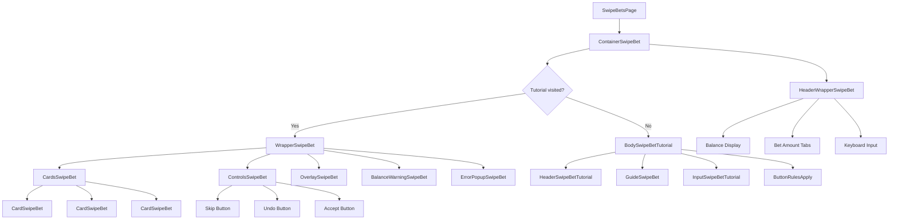
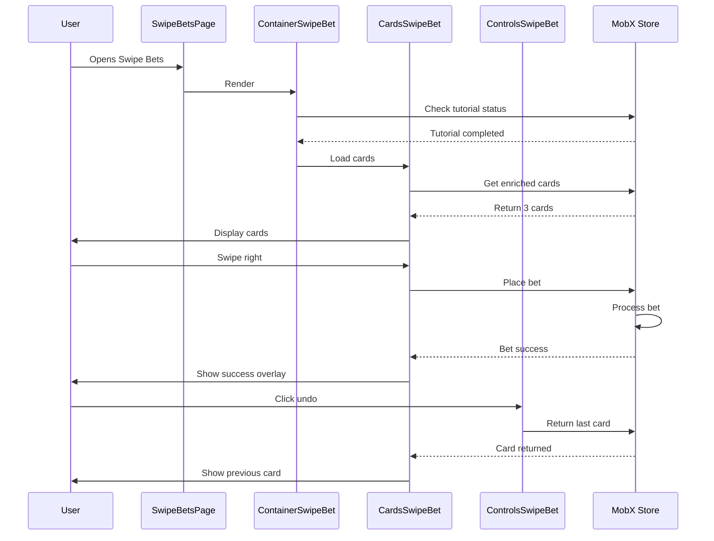

# Component structure

This document describes the component architecture of the Swipe Bets feature, including the hierarchy, responsibilities, and interactions between components.

## Component hierarchy

```
src/pages/SwipeBetsPage/
└── SwipeBetsPage.tsx (Root page component)
    └── ContainerSwipeBet.tsx (Main container)
        ├── HeaderWrapperSwipeBet.tsx (Header with controls)
        └── WrapperSwipeBet.tsx | BodySwipeBetTutorial.tsx (Content)
            ├── CardsSwipeBet.tsx (Card container)
            │   └── CardSwipeBet.tsx (Individual cards)
            ├── ControlsSwipeBet.tsx (Action buttons)
            ├── OverlaySwipeBet.tsx (Feedback overlay)
            ├── BalanceWarningSwipeBet.tsx (Low balance warning)
            └── ErrorPopupSwipeBet.tsx (Error display)
```

## Component diagram



## Core components

### SwipeBetsPage

**Location**: `src/pages/SwipeBetsPage/SwipeBetsPage.tsx`

**Purpose**: Root page component that manages bet state.

**Props**: None

**State**:
```typescript
const [betState, setBetState] = useState<'progress' | 'success' | 'error' | ''>('');
```

**Responsibilities**:
- Initialize page
- Manage bet placement state
- Pass state to child components
- Handle pointer events during bet placement

**Example**:
```tsx
export const SwipeBetsPage = observer(() => {
  const [betState, setBetState] = useState<'progress' | 'success' | 'error' | ''>('');

  return (
    <div className={`swipe-bets-page ${betState === 'progress' ? 'pointer-events-none' : ''}`}>
      <ContainerSwipeBet betState={betState} setBetState={setBetState} />
    </div>
  );
});
```

### ContainerSwipeBet

**Location**: `src/modules/SwipeBet/ContainerSwipeBet.tsx`

**Purpose**: Main container that decides between tutorial and main interface.

**Props**:
```typescript
interface ContainerSwipeBetProps {
  betState: 'progress' | 'success' | 'error' | '';
  setBetState: (state: 'progress' | 'success' | 'error' | '') => void;
}
```

**State**:
```typescript
const [showWarning, setShowWarning] = useState(false);
const [betsPreset, setBetsPreset] = useState<string | null>(swipeBetsPreset || null);
```

**Responsibilities**:
- Check tutorial status
- Manage bet preset amount
- Show/hide balance warning
- Route to tutorial or main interface

**Example**:
```tsx
export const ContainerSwipeBet = observer(({ betState, setBetState }) => {
  const swipeBetsTutorialVisited = mobx.swipeBets.getSwipeBetsTutorialVisited();
  
  return (
    <>
      <HeaderWrapperSwipeBet />
      {swipeBetsTutorialVisited ? (
        <WrapperSwipeBet betState={betState} setBetState={setBetState} />
      ) : (
        <BodySwipeBetTutorial />
      )}
    </>
  );
});
```

### HeaderWrapperSwipeBet

**Location**: `src/modules/SwipeBet/parts/HeaderWrapperSwipeBet.tsx`

**Purpose**: Header with balance, bet amount controls, and navigation.

**Props**:
```typescript
interface HeaderWrapperSwipeBetProps {
  betState: 'progress' | 'success' | 'error' | '';
  betsPreset: string | null;
  setBetsPreset: (value: string | null) => void;
  setShowWarning: (value: boolean) => void;
}
```

**Responsibilities**:
- Display user balance
- Show bet amount tabs (Custom/Max)
- Handle bet amount input
- Navigate back
- Show tutorial button

**Features**:
- Balance display with currency
- Custom/Max bet tabs
- Numeric keyboard input
- Back navigation
- Tutorial access

### WrapperSwipeBet

**Location**: `src/modules/SwipeBet/parts/SwipeBet/WrapperSwipeBet.tsx`

**Purpose**: Main betting interface with cards and controls.

**Props**:
```typescript
interface WrapperSwipeBetProps {
  betState: 'progress' | 'success' | 'error' | '';
  setBetState: (state: 'progress' | 'success' | 'error' | '') => void;
}
```

**Responsibilities**:
- Load and display cards
- Handle swipe gestures
- Manage bet placement
- Show feedback overlays
- Handle errors

**Features**:
- Card swiping
- Bet placement
- Success/error feedback
- Balance warnings
- Undo functionality

### CardsSwipeBet

**Location**: `src/modules/SwipeBet/parts/SwipeBet/CardsSwipeBet.tsx`

**Purpose**: Container for swipeable betting cards.

**Props**:
```typescript
interface CardsSwipeBetProps {
  enrichedCards: IEnrichedSwipeBetCard[];
  onSwipe: (direction: 'left' | 'right') => void;
  betState: 'progress' | 'success' | 'error' | '';
}
```

**Responsibilities**:
- Render 3 visible cards
- Handle swipe gestures
- Animate card transitions
- Manage card stack

**Features**:
- Swipe detection
- Card animations
- Stack management
- Touch/mouse events

### CardSwipeBet

**Location**: `src/modules/SwipeBet/parts/SwipeBet/CardSwipeBet.tsx`

**Purpose**: Individual betting card with event and market information.

**Props**:
```typescript
interface CardSwipeBetProps {
  card: IEnrichedSwipeBetCard;
  index: number;
  isActive: boolean;
}
```

**Responsibilities**:
- Display event information
- Show market and outcome
- Display odds
- Calculate possible win

**Card content**:
```
┌─────────────────────────────┐
│ Tournament Name             │
│ ⚽ Discipline Icon          │
├─────────────────────────────┤
│ Team A vs Team B            │
│ 🕐 Event Time               │
├─────────────────────────────┤
│ Market: Match Winner        │
│ Outcome: Team A             │
│                             │
│ Odds: 2.50                  │
│ Possible Win: $25.00        │
└─────────────────────────────┘
```

### ControlsSwipeBet

**Location**: `src/modules/SwipeBet/parts/SwipeBet/ControlsSwipeBet.tsx`

**Purpose**: Action buttons for card interaction.

**Props**:
```typescript
interface ControlsSwipeBetProps {
  onSkip: () => void;
  onUndo: () => void;
  onAccept: () => void;
  canUndo: boolean;
}
```

**Responsibilities**:
- Skip button (swipe left)
- Undo button (return last card)
- Accept button (swipe right)
- Button state management

**Button layout**:
```
┌─────────────────────────────┐
│  [←]    [↶]    [✓]         │
│  Skip   Undo   Accept       │
└─────────────────────────────┘
```

### OverlaySwipeBet

**Location**: `src/modules/SwipeBet/parts/SwipeBet/OverlaySwipeBet.tsx`

**Purpose**: Visual feedback overlay for bet states.

**Props**:
```typescript
interface OverlaySwipeBetProps {
  betState: 'progress' | 'success' | 'error' | '';
}
```

**Responsibilities**:
- Show loading state
- Show success animation
- Show error state
- Auto-hide after delay

**States**:
- **Progress**: Loading spinner
- **Success**: Checkmark animation
- **Error**: Error icon
- **Empty**: Hidden

## Tutorial components

### BodySwipeBetTutorial

**Location**: `src/modules/SwipeBet/parts/SwipeBetTutorial/BodySwipeBetTutorial.tsx`

**Purpose**: Tutorial interface for first-time users.

**Props**:
```typescript
interface BodySwipeBetTutorialProps {
  betsPreset: string | null;
  setBetsPreset: (value: string | null) => void;
  setShowWarning: (value: boolean) => void;
  showWarning: boolean;
}
```

**Responsibilities**:
- Show tutorial steps
- Explain swipe gestures
- Allow bet amount setup
- Mark tutorial as completed

**Tutorial steps**:
1. Welcome message
2. Swipe left explanation
3. Swipe right explanation
4. Bet amount setup
5. Start betting

### GuideSwipeBet

**Location**: `src/modules/SwipeBet/parts/SwipeBetTutorial/GuideSwipeBet.tsx`

**Purpose**: Visual guide showing swipe gestures.

**Features**:
- Animated card example
- Swipe direction indicators
- Gesture explanations
- Interactive demo

### HeaderSwipeBetTutorial

**Location**: `src/modules/SwipeBet/parts/SwipeBetTutorial/HeaderSwipeBetTutorial.tsx`

**Purpose**: Tutorial header with progress indicator.

**Features**:
- Step counter
- Progress bar
- Skip tutorial button
- Back navigation

## Supporting components

### KeyboardSwipeBet

**Location**: `src/modules/SwipeBet/parts/SwipeBetKeyboard/KeyboardSwipeBet.tsx`

**Purpose**: Numeric keyboard for bet amount input.

**Features**:
- Number buttons (0-9)
- Decimal point
- Backspace
- Clear button

### BalanceWarningSwipeBet

**Location**: `src/modules/SwipeBet/parts/SwipeBet/BalanceWarningSwipeBet.tsx`

**Purpose**: Warning when balance is low.

**Features**:
- Balance check
- Deposit link
- Warning message
- Dismissible

### ErrorPopupSwipeBet

**Location**: `src/modules/SwipeBet/parts/SwipeBet/ErrorPopupSwipeBet.tsx`

**Purpose**: Error message display.

**Features**:
- Error message
- Error code
- Retry button
- Close button

## Component interactions



## Styling

All components use SCSS modules with the following structure:

```scss
// ContainerSwipeBet.scss
.swipe-bet {
  &__container {
    // Container styles
  }
  
  &__header {
    // Header styles
  }
  
  &__content {
    // Content styles
  }
  
  &__border {
    // Border styles
  }
}
```

## Best practices

### Component design

1. **Single responsibility**: Each component has one clear purpose
2. **Composition**: Build complex UIs from simple components
3. **Props validation**: Use TypeScript interfaces
4. **Observer pattern**: Use MobX observer for reactive components

### Performance

1. **Memoization**: Use React.memo for expensive components
2. **Lazy loading**: Load components on demand
3. **Debouncing**: Debounce swipe gestures
4. **Efficient updates**: Minimize re-renders

### Accessibility

1. **Keyboard navigation**: Support keyboard controls
2. **Screen readers**: Add ARIA labels
3. **Focus management**: Handle focus states
4. **Touch targets**: Ensure adequate button sizes

## Next steps

- [API integration](./api) - Learn about API endpoints
- [MobX Store](./mobx-store) - Understand state management
- [User flow](./flow) - See complete user journeys
