# User flow

This document provides detailed flow diagrams and scenarios for all user interactions with the Swipe Bets feature.

## Complete user journey


## First-time user flow

### Tutorial experience


### Tutorial steps

1. **Welcome screen**
   - Introduction to Swipe Bets
   - Brief explanation of feature
   - "Get Started" button

2. **Swipe left demo**
   - Animated card showing left swipe
   - "Skip this bet" explanation
   - Visual indicators

3. **Swipe right demo**
   - Animated card showing right swipe
   - "Place this bet" explanation
   - Visual indicators

4. **Bet amount setup**
   - Custom amount input
   - Max bet option
   - Preset amount selection

5. **Completion**
   - "Start Betting" button
   - Transition to main interface

## Regular betting flow

### Successful bet placement


### Bet placement states


## Card navigation flow

### Swipe left (skip)


### Swipe right (place bet)


### Undo action


## Bet amount management

### Custom amount flow


### Max bet flow


## Error handling flows

### Insufficient funds


### Market closed


### Coefficient changed


## Loading and pagination

### Initial load

```mermaid
flowchart TD
    Start([Page opens]) --> ShowLoader[Show loading state]
    ShowLoader --> InitSocket[Initialize WebSocket]
    InitSocket --> FetchPage1[Fetch page 1 (100 items)]
    FetchPage1 --> Subscribe[Subscribe to first 3 cards]
    Subscribe --> EnrichCards[Enrich cards]
    EnrichCards --> HideLoader[Hide loading state]
    HideLoader --> DisplayCards[Display 3 cards]
```

### Load more cards

```mermaid
flowchart TD
    Start([User swipes cards]) --> CheckRemaining{Remaining cards ≤ 3?}
    CheckRemaining -->|No| Continue[Continue swiping]
    CheckRemaining -->|Yes| IncrementPage[Increment page number]
    
    IncrementPage --> FetchNext[Fetch next page]
    FetchNext --> AppendData[Append to existing data]
    AppendData --> Continue
```



### Empty enriched cards


## Real-time updates

### WebSocket update flow


### Subscription management


## Analytics tracking

### Bet placement analytics


## Edge cases

### No recommendations available


### WebSocket disconnection


### Rapid swipes

```mermaid
flowchart TD
    Start([User swipes rapidly]) --> CheckAnimation{Animation in progress?}
    
    CheckAnimation -->|Yes| IgnoreSwipe[Ignore swipe]
    CheckAnimation -->|No| SetFlag[Set animation flag]
    
    SetFlag --> ProcessSwipe[Process swipe]
    ProcessSwipe --> ClearFlag[Clear animation flag]
    ClearFlag --> Ready[Ready for next swipe]
    
    IgnoreSwipe --> Ready
```

## Best practices

### User experience

1. **Smooth animations**: Use CSS transitions for card movements
2. **Immediate feedback**: Show loading states instantly
3. **Clear messaging**: Display helpful error messages
4. **Undo option**: Always allow returning last card
5. **Tutorial**: Guide first-time users

### Performance

1. **Lazy loading**: Load cards in batches
2. **Smart subscriptions**: Only subscribe to visible cards
3. **Debouncing**: Prevent rapid actions
4. **Caching**: Reuse enriched data

### Error recovery

1. **Retry logic**: Automatically retry failed requests
2. **Fallback**: Load next page on errors
3. **User feedback**: Show clear error states
4. **Graceful degradation**: Handle missing data

## Next steps

- [Component structure](./components) - Understand components
- [API integration](./api) - Learn about API endpoints
- [MobX Store](./mobx-store) - Explore state management
