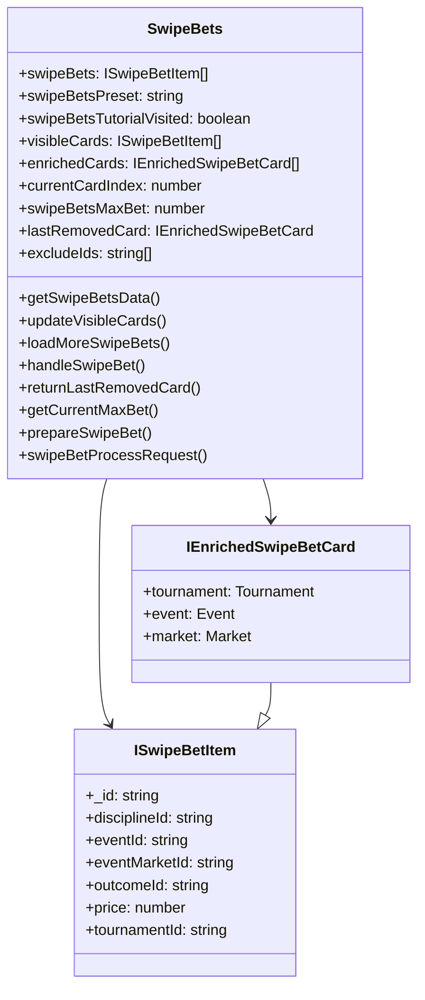
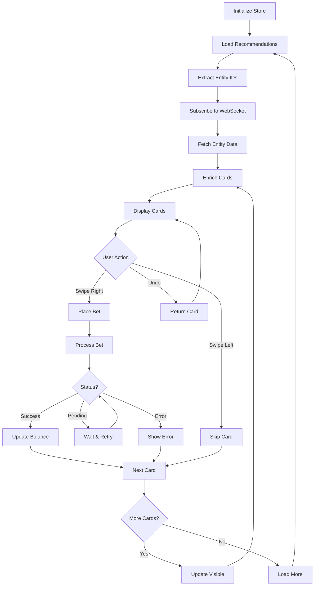

# MobX Store

The SwipeBets MobX store (`SwipeBets.mobx.ts`) manages all state and business logic for the Swipe Bets feature.

## Store structure



## State properties

### Core data

#### swipeBets
```typescript
swipeBets: ISwipeBetItem[] = []
```
Raw recommendation data from API.

#### swipeBetsData
```typescript
swipeBetsData: ISwipeBetsData | null = null
```
Complete API response with metadata.

```typescript
interface ISwipeBetsData {
  data: ISwipeBetItem[];
  meta: {
    pageNumber: number;
    pageSize: number;
    totalRows: number;
  };
}
```

#### visibleCards
```typescript
visibleCards: ISwipeBetItem[] = []
```
Currently visible cards (max 3).

#### enrichedCards (computed)
```typescript
get enrichedCards(): IEnrichedSwipeBetCard[]
```
Visible cards enriched with WebSocket data.

**Enrichment process**:
1. Match tournament by `1.{disciplineId}.{tournamentId}`
2. Match event by `1.{eventId}`
3. Match market by `1.{eventId}.{eventMarketId}`
4. Verify relationships (event in tournament, market in event)
5. Return enriched card or null

### User preferences

#### swipeBetsPreset
```typescript
swipeBetsPreset: string | null = null
```
User's preferred bet amount. Persisted in localStorage.

**Usage**:
```typescript
// Set preset
mobx.swipeBets.setSwipeBetsPreset('10.00');

// Get preset
const preset = mobx.swipeBets.getSwipeBetsPreset();
```

#### swipeBetsTutorialVisited
```typescript
swipeBetsTutorialVisited: boolean = false
```
Whether user has completed tutorial. Persisted in localStorage.

**Usage**:
```typescript
// Check status
const visited = mobx.swipeBets.getSwipeBetsTutorialVisited();

// Mark as visited
mobx.swipeBets.setSwipeBetsTutorialVisited(true);
```

#### swipeBetCurrentTab
```typescript
swipeBetCurrentTab: 'custom' | 'max' = 'custom'
```
Current bet amount tab selection.

### Navigation state

#### currentCardIndex
```typescript
currentCardIndex: number = 0
```
Index of current card in the data array.

#### cardsPageNumber
```typescript
cardsPageNumber: number = 1
```
Current page number for pagination.

#### lastRemovedCard
```typescript
lastRemovedCard: IEnrichedSwipeBetCard | null = null
```
Last swiped card for undo functionality.

#### isCardReturned
```typescript
isCardReturned: boolean = false
```
Flag indicating if last card was returned.

### Loading states

#### isLoadingInitialCards
```typescript
isLoadingInitialCards: boolean = false
```
Loading state for initial data fetch.

#### isLoadingMoreCards
```typescript
isLoadingMoreCards: boolean = false
```
Loading state for pagination.

#### isAnimationInProgress
```typescript
isAnimationInProgress: boolean = false
```
Flag to prevent multiple simultaneous swipes.

### Bet processing

#### swipeBetsMaxBet
```typescript
swipeBetsMaxBet: number | null = null
```
Maximum allowed bet amount for current card.

#### swipeBetData
```typescript
swipeBetData: any = null
```
Current bet processing data.

#### isWaitingSwipeBet
```typescript
isWaitingSwipeBet: boolean = false
```
Flag indicating bet is being processed.

#### hasSwipeBetError
```typescript
hasSwipeBetError: boolean = false
```
Flag indicating bet placement error.

#### processRequestCounter
```typescript
processRequestCounter: number = 0
```
Counter for bet processing retries (max 5).

### WebSocket subscriptions

#### subscribedMarketIds
```typescript
subscribedMarketIds: string[] = []
```
Currently subscribed market IDs.

#### subscribedEventIds
```typescript
subscribedEventIds: string[] = []
```
Currently subscribed event IDs.

#### subscribedTournamentIds
```typescript
subscribedTournamentIds: string[] = []
```
Currently subscribed tournament IDs.

#### swipeBetsMarkets
```typescript
swipeBetsMarkets: { resolved: object[]; rejected: string[] }
```
Market entities from WebSocket.

#### swipeBetsEvents
```typescript
swipeBetsEvents: { resolved: object[]; rejected: string[] }
```
Event entities from WebSocket.

#### swipeBetsTournaments
```typescript
swipeBetsTournaments: { resolved: object[]; rejected: string[] }
```
Tournament entities from WebSocket.

### Exclusion management

#### excludeIds
```typescript
excludeIds: string[] = []
```
IDs of recommendations to exclude. Persisted in localStorage.

**Usage**:
```typescript
// Add ID to exclusion list
mobx.swipeBets.addExcludedId('rec_123');

// Excluded IDs are automatically used in API requests
```

## Actions

### Data loading

#### getSwipeBetsData
```typescript
async getSwipeBetsData({
  disciplinesIds = [],
  excludeIds,
  pageSize = 100
}: {
  disciplinesIds?: string[];
  excludeIds?: string[];
  pageSize?: number;
}): Promise<void>
```

Loads initial recommendations and subscribes to WebSocket entities.

**Process**:
1. Initialize WebSocket connection
2. Fetch recommendations from API
3. Extract entity IDs from recommendations
4. Subscribe to tournaments, events, and markets
5. Fetch entity data from WebSocket
6. Set visible cards and enriched data

**Example**:
```typescript
await mobx.swipeBets.getSwipeBetsData({
  disciplinesIds: ['1', '2'],
  pageSize: 100
});
```

#### loadMoreSwipeBets
```typescript
async loadMoreSwipeBets({
  disciplinesIds = [],
  excludeIds,
  pageNumber = 1,
  pageSize = 100
}: {
  disciplinesIds?: string[];
  excludeIds?: string[];
  pageNumber?: number;
  pageSize?: number;
}): Promise<void>
```

Loads next page of recommendations.

**Example**:
```typescript
await mobx.swipeBets.loadMoreSwipeBets({
  disciplinesIds: ['1'],
  pageNumber: 2,
  pageSize: 100
});
```

#### loadNextPageWhenEnrichedEmpty
```typescript
async loadNextPageWhenEnrichedEmpty(): Promise<void>
```

Automatically loads next page when enriched cards are empty but raw cards exist.

### Card management

#### updateVisibleCards
```typescript
async updateVisibleCards(): Promise<void>
```

Updates visible cards and manages WebSocket subscriptions.

**Process**:
1. Increment card index (unless returning)
2. Slice next 3 cards from data
3. Build entity IDs for new cards
4. Unsubscribe from old entities
5. Subscribe to new entities
6. Fetch new entity data
7. Update visible cards and enriched data
8. Load more cards if needed (≤3 remaining)

**Example**:
```typescript
// Called automatically after swipe
await mobx.swipeBets.updateVisibleCards();
```

#### returnLastRemovedCard
```typescript
async returnLastRemovedCard(): Promise<void>
```

Returns the last swiped card for undo functionality.

**Process**:
1. Check if last card exists
2. Decrement card index
3. Fetch entity data for returned card
4. Update subscriptions
5. Add card back to visible cards

**Example**:
```typescript
// Undo last swipe
await mobx.swipeBets.returnLastRemovedCard();
```

### Bet placement

#### handleSwipeBet
```typescript
async handleSwipeBet(
  marketId: string,
  outcomeId: string
): Promise<{ delay: number; hasError: boolean; status: number }>
```

Main bet placement handler.

**Process**:
1. Check if already processing
2. Reset error state
3. Create and place bet
4. Track analytics (BEGIN_CHECKOUT)
5. Process bet response
6. Update balance
7. Return result

**Example**:
```typescript
const result = await mobx.swipeBets.handleSwipeBet(
  '1.12345.67890',
  'outcome_123'
);

if (result.hasError) {
  // Handle error
} else {
  // Show success
}
```

#### makeSwipeBet
```typescript
async makeSwipeBet({
  bubblePostMessage = true,
  outcomeId,
  marketId,
  trackMarks = [betTrackMark.swipeBet]
}: {
  bubblePostMessage?: boolean;
  outcomeId: string;
  marketId: string;
  trackMarks?: string[];
}): Promise<{ bet: any; response: any }>
```

Creates and places a bet.

**Process**:
1. Initialize bet in betslip
2. Validate bet
3. Prepare bet data
4. Send to API
5. Track analytics (ADD_BET)
6. Return response

#### prepareSwipeBet
```typescript
prepareSwipeBet(bet: any): {
  amount: number;
  coefficient: number;
  currency: string;
  outcomeId: string;
  trackMarks: string[];
} | null
```

Prepares bet data for API submission.

**Process**:
1. Get outcome from store
2. Determine amount (custom or max)
3. Build bet object
4. Return prepared data

#### swipeBetProcessRequest
```typescript
async swipeBetProcessRequest(
  data: any,
  bet: any
): Promise<{ delay: number; hasError: boolean; status: number }>
```

Processes bet placement response with retry logic.

**Process**:
1. Check bet status
2. If pending (status 0), wait and retry
3. If coefficient changed (status 2), show alert
4. Track analytics (PLACE_BET or REFUND)
5. Handle errors
6. Return final result

**Status codes**:
- `0`: Pending - retry after delay
- `1`: Success
- `2`: Coefficient changed
- Other: Error

### Max bet calculation

#### getCurrentMaxBet
```typescript
async getCurrentMaxBet(): Promise<void>
```

Calculates maximum bet for current card.

**Process**:
1. Get first enriched card
2. Initialize bet
3. Build query string
4. Call max bet API
5. Store result in `swipeBetsMaxBet`

**Example**:
```typescript
await mobx.swipeBets.getCurrentMaxBet();
const maxBet = mobx.swipeBets.swipeBetsMaxBet;
```

#### getSwipeBetPossibleWin
```typescript
getSwipeBetPossibleWin(amount: number, odd: number): number
```

Calculates possible winnings.

**Logic**:
```typescript
if (currentTab === 'max' && maxBet) {
  return roundCurrency(maxBet * odd);
} else {
  return roundCurrency(amount * odd);
}
```

### WebSocket management

#### subscribeToMarkets
```typescript
subscribeToMarkets(marketIds: string[]): void
```

Subscribes to market updates.

#### unsubscribeFromMarkets
```typescript
unsubscribeFromMarkets(marketIds: string[]): void
```

Unsubscribes from market updates.

#### initSocketConnection
```typescript
async initSocketConnection(): Promise<void>
```

Initializes WebSocket connection.

### State setters

#### setSwipeBetsPreset
```typescript
setSwipeBetsPreset(value: string): void
```

Sets bet amount preset.

#### setSwipeBetsTutorialVisited
```typescript
setSwipeBetsTutorialVisited(value: boolean): void
```

Marks tutorial as visited.

#### setHasSwipeBetError
```typescript
setHasSwipeBetError(hasError: boolean): void
```

Sets error state.

#### setIsWaitingSwipeBet
```typescript
setIsWaitingSwipeBet(value: boolean): void
```

Sets waiting state.

## Computed properties

### enrichedCards
```typescript
get enrichedCards(): IEnrichedSwipeBetCard[]
```

Returns visible cards enriched with WebSocket data.

**Enrichment logic**:
```typescript
visibleCards.map(card => {
  const tournament = findTournament(card);
  const event = findEvent(card);
  const market = findMarket(card);
  
  // Verify relationships
  if (tournament && event && market &&
      event.pid === tournament.lid &&
      market.lid.startsWith(event.lid)) {
    return { ...card, tournament, event, market };
  }
  
  return null; // Invalid relationships
}).filter(card => card !== null);
```

### isMarketInLine
```typescript
get isMarketInLine(): boolean
```

Checks if current card's market is in the line store.

## Data flow diagram



## Usage examples

### Complete initialization

```typescript
import { mobx } from '@/lib/mobx';

// Initialize Swipe Bets
await mobx.swipeBets.getSwipeBetsData({
  disciplinesIds: ['1', '2'],
  pageSize: 100
});

// Access enriched cards
const cards = mobx.swipeBets.enrichedCards;

// Get current card
const currentCard = cards[0];
```

### Place bet workflow

```typescript
// Set bet amount
mobx.swipeBets.setSwipeBetsPreset('10.00');

// Calculate max bet
await mobx.swipeBets.getCurrentMaxBet();

// Place bet
const result = await mobx.swipeBets.handleSwipeBet(
  currentCard.market.lid,
  currentCard.outcomeId
);

// Handle result
if (result.hasError) {
  console.error('Bet failed');
} else {
  console.log('Bet placed');
  // Move to next card
  await mobx.swipeBets.updateVisibleCards();
}
```

### Undo workflow

```typescript
// User swipes card
await mobx.swipeBets.updateVisibleCards();

// User clicks undo
await mobx.swipeBets.returnLastRemovedCard();

// Previous card is restored
```

## Best practices

### Performance

1. **Batch operations**: Load cards in batches of 100
2. **Lazy subscriptions**: Only subscribe to visible cards
3. **Debounce actions**: Prevent rapid swipes
4. **Cache data**: Reuse enriched cards

### Error handling

1. **Validate data**: Check card relationships
2. **Retry logic**: Retry failed requests
3. **Fallback**: Load next page on errors
4. **User feedback**: Show clear error messages

### State management

1. **Immutability**: Use MobX observables
2. **Computed values**: Use getters for derived state
3. **Actions**: Wrap mutations in actions
4. **Persistence**: Save preferences to localStorage

## Next steps

- [User flow](./flow) - See complete user journeys
- [API integration](./api) - Learn about API endpoints
- [Component structure](./components) - Understand components
