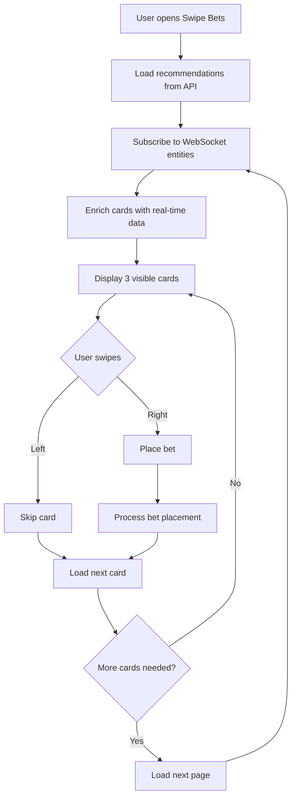

# Swipe Bets overview

Swipe Bets is a mobile-first betting feature that provides a Tinder-like interface for quick bet placement. Users swipe through personalized betting recommendations and place bets with preset or maximum amounts.

## What is Swipe Bets?

Swipe Bets transforms the betting experience into an engaging, card-based interface where users can:

- **Swipe through recommendations**: Browse personalized betting cards
- **Quick bet placement**: Place bets with one swipe using preset amounts
- **Real-time updates**: Get live odds and market data via WebSocket
- **Smart recommendations**: Receive AI-powered betting suggestions
- **Tutorial system**: Learn the interface with an interactive guide

## Key features

### Card-based interface

The interface displays betting recommendations as swipeable cards, showing:
- Event information (teams, tournament, time)
- Market and outcome details
- Current odds
- Possible winnings

### Quick betting

Users can place bets instantly by:
- Swiping right to accept a bet
- Swiping left to skip
- Using preset bet amounts
- Using maximum bet calculation

### Real-time data

All cards are enriched with live data:
- Tournament information
- Event details and scores
- Market odds updates
- Outcome availability

### Personalization

The system provides personalized recommendations based on:
- User betting history
- Preferred disciplines
- Popular events
- Tier-based ranking

## How it works



## Architecture overview

### Components hierarchy

```
SwipeBetsPage
└── ContainerSwipeBet
    ├── HeaderWrapperSwipeBet
    │   ├── Balance display
    │   ├── Bet amount controls
    │   └── Tutorial button
    └── WrapperSwipeBet (or Tutorial)
        ├── CardsSwipeBet
        │   └── CardSwipeBet (×3)
        │       ├── Event info
        │       ├── Market details
        │       └── Outcome odds
        ├── ControlsSwipeBet
        │   ├── Skip button
        │   ├── Undo button
        │   └── Accept button
        └── OverlaySwipeBet
            └── Bet state feedback
```

### State management

The feature uses MobX for state management with the `SwipeBets.mobx.ts` store handling:
- Recommendations data
- Visible cards
- WebSocket subscriptions
- Bet placement
- User preferences

### Data flow

1. **Initialization**: Load recommendations from API
2. **Subscription**: Subscribe to WebSocket for real-time updates
3. **Enrichment**: Combine API data with WebSocket entities
4. **Display**: Show enriched cards to user
5. **Interaction**: Handle swipe gestures and bet placement
6. **Update**: Load more cards as needed

## Use cases

### First-time user

1. User opens Swipe Bets
2. Tutorial is displayed
3. User learns swipe gestures
4. User sets bet amount
5. Tutorial is marked as completed
6. User starts swiping cards

### Regular betting

1. User opens Swipe Bets
2. Cards are loaded with recommendations
3. User swipes through cards
4. User accepts a bet by swiping right
5. Bet is placed automatically
6. Success feedback is shown
7. Next card appears

### Undo action

1. User accidentally swipes a card
2. User clicks undo button
3. Previous card returns
4. User can review and decide again

## Benefits

### For users

- **Fast betting**: Place bets in seconds
- **Easy to use**: Simple swipe gestures
- **Personalized**: Relevant recommendations
- **Mobile-optimized**: Perfect for mobile devices
- **Real-time**: Always up-to-date odds

### For operators

- **Increased engagement**: Fun, gamified interface
- **Higher conversion**: Easier bet placement
- **Better retention**: Addictive user experience
- **Data insights**: Track user preferences
- **Mobile-first**: Optimized for mobile users

## Technical highlights

### Performance optimization

- **Lazy loading**: Cards loaded in batches of 100
- **Smart subscriptions**: Only subscribe to visible cards
- **Efficient updates**: Minimal re-renders with MobX
- **Caching**: Reuse enriched card data

### Error handling

- **Retry logic**: Automatic retry for failed requests
- **Fallback**: Load next page if current is empty
- **Validation**: Validate bets before placement
- **User feedback**: Clear error messages

### Analytics integration

Comprehensive tracking for:
- Bet additions
- Checkout events
- Successful placements
- Errors and refunds

## Next steps

- [Component structure](./components) - Detailed component documentation
- [API integration](./api) - API endpoints and usage
- [MobX Store](./mobx-store) - State management details
- [User flow](./flow) - Complete user journey diagrams
